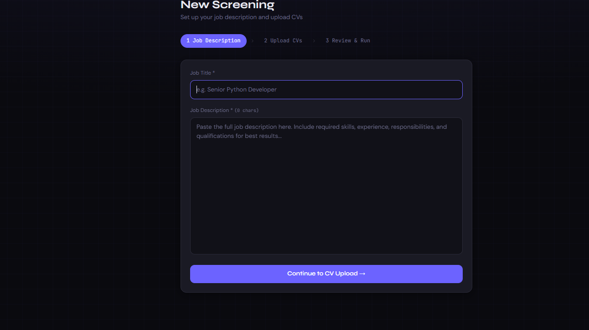
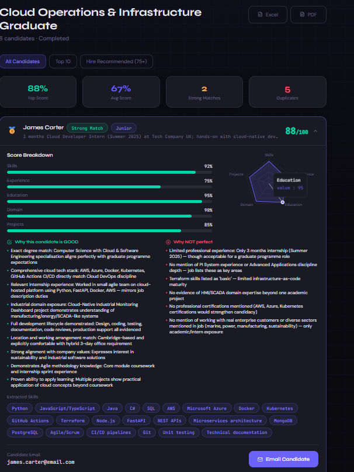
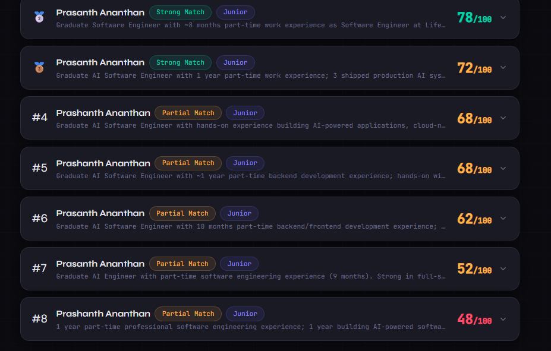

<div align="center">

# 🤖 AI Recruitment Intelligence System

### One job post. Hundreds of CVs. One person to read them all.

*So I built something that reads every single one — and explains its thinking like a recruiter would.*


</div>

---

## 📸 Screenshots

### Dashboard — set up a screening


### Candidate Analysis — transparent, explainable scoring


### Ranked Candidates — the shortlist at a glance


---

## The problem I kept seeing

A company posts one role and hundreds of CVs land in the inbox. No human can read them all properly — so they skim, they rush, and good people get missed. Plain keyword filters are worse: they throw away anyone who didn't phrase their CV the "right" way.

I wanted something that does what a good recruiter does, but at scale: actually *read* each CV, weigh it against the role, and be able to say **why** it ranked someone where it did.

## What I built

A full-stack system that takes a job description and a pile of CVs, reads every one in full, and hands back a ranked shortlist — each candidate with a clear score and the real reasons behind it. Strengths, gaps, the lot. No mystery number, no black box.

> **It assists, it doesn't decide.** The system surfaces and explains the best matches. A human recruiter always makes the final call. That line matters — AI should speed hiring up, not quietly gatekeep it.

---

## 🛠️ Skills demonstrated

For anyone scanning for fit — this project put the following into practice:

`LLM Prompt Engineering` · `Information Extraction` · `Explainable AI` · `OCR Pipelines`
`FastAPI` · `Full-Stack Development (MERN)` · `REST API Design` · `MongoDB Data Modeling`
`Parallel / Batch Processing` · `Multi-Service Architecture` · `Secure File Handling`

---

## What it does

| Feature | What it does |
|---|---|
| 📥 **Flexible CV intake** | Drop files, drag-and-drop, or **pick a whole folder in one click** (works online). Local folder-path mode too. |
| 🧠 **Reads every CV** | Pulls name, contact, skills, experience, education and projects from PDF/DOCX — with OCR for scanned files. |
| 📊 **Scores across five dimensions** | Skills, experience, domain, education, projects → one weighted 0–100 match score. |
| 🪟 **Explains itself** | Every score comes with specific strengths and gaps, tied to the actual job requirements. |
| 🏆 **Ranks and filters** | Full ranked table, top-10 shortlist, "hire recommended" view. |
| ✉️ **One-click contact** | Each card shows the candidate's email with a button that opens a ready-to-send interview invite. |
| 🚨 **Flags problems** | Spots duplicate CVs and inconsistencies on its own. |
| 📤 **Exports** | One click to Excel or PDF for sharing with the hiring team. |

---

## How it's built

Three services, each doing one job well, talking to each other:

```
                    ┌──────────────┐
                    │     User     │
                    └──────┬───────┘
                           │
                    ┌──────▼───────┐
                    │   React UI   │   Vite · Tailwind · Recharts
                    │   (:5173)    │
                    └──────┬───────┘
                           │  REST
                    ┌──────▼───────┐
                    │  Node API    │   Express · Multer · exports
                    │   (:5000)    │
                    └──────┬───────┘
                           │  REST
                    ┌──────▼───────┐
                    │ FastAPI AI   │   Claude · OCR · scoring
                    │   (:8000)    │
                    └──────┬───────┘
                           │
                    ┌──────▼───────┐
                    │   MongoDB    │   Atlas
                    └──────────────┘
```

| Layer | Tech | Job |
|---|---|---|
| **Frontend** | React, Vite, TailwindCSS, Framer Motion, Recharts | The dashboard, the results, the exports |
| **API Gateway** | Node.js, Express, MongoDB, Multer | Orchestration, storage, file handling, reports |
| **AI Engine** | Python, FastAPI, Anthropic Claude, pdfplumber, python-docx | Parsing, OCR, scoring, ranking |

The AI engine chews through CVs in parallel batches and writes results to MongoDB; the frontend polls it so you watch progress live.

---

## How the scoring actually works

Every CV gets a weighted score out of 100:

```
Total = Skills      × 30%
      + Experience  × 25%
      + Domain      × 20%
      + Education   × 15%
      + Projects    × 10%
```

But the number isn't the point — the *reasoning* is. For each candidate the AI returns the exact skills that matched, the experience that lined up, and the gaps against the role. That's what makes it something you can trust instead of just obey.

---

## Run it yourself

**You'll need:** Node.js 18+, Python 3.10+, MongoDB ([Atlas free tier](https://www.mongodb.com/atlas) is fine), and an [Anthropic API key](https://console.anthropic.com).

**1. Clone & install**
```bash
git clone https://github.com/PrashanthAnanthan/AI-Recruitment-Intelligence-System.git
cd AI-Recruitment-Intelligence-System

cd frontend && npm install
cd ../backend-node && npm install
cd ../backend-python
python -m venv venv
venv\Scripts\activate          # Windows
# source venv/bin/activate     # macOS/Linux
pip install -r requirements.txt
```

**2. Set up environment variables** — copy each `.env.example` to `.env` and fill in your values.

`backend-node/.env`
```env
PORT=5000
MONGO_URI=your_mongodb_connection_string
PYTHON_API_URL=http://localhost:8000
FRONTEND_URL=http://localhost:5173
JWT_SECRET=your_secret_here
```

`backend-python/.env`
```env
MONGO_URI=your_mongodb_connection_string
ANTHROPIC_API_KEY=your_anthropic_key_here
```

> AWS S3 and Google Drive keys are optional — only for pulling CVs from those sources. Upload and folder selection work without them.

**3. Run all three** (one terminal each)
```bash
cd frontend && npm run dev
cd backend-node && npm run dev
cd backend-python && python -m uvicorn main:app --reload --port 8000
```

Open **http://localhost:5173** and go.

---

## Where CVs can come from

| Source | Works online? | Notes |
|---|---|---|
| **Local Files** | ✅ | Drag-and-drop or browse |
| **Select Folder** | ✅ | Pick a whole folder in one click (Chrome/Edge) |
| **Folder Path** | ⚠️ Local only | Type a path — only when the server runs on your own machine |
| **Google Drive / AWS S3** | ✅ | Needs cloud credentials |

---

## The stack

**Frontend:** React · Vite · TailwindCSS · Framer Motion · Recharts · React Router
**Backend:** Node.js · Express · MongoDB · Mongoose · Multer · ExcelJS · PDFKit
**AI Engine:** Python · FastAPI · Anthropic Claude (Haiku) · pdfplumber · python-docx · Tesseract OCR
**Cloud:** MongoDB Atlas · AWS S3 · Google Drive API

---

## ⚙️ Performance

- Processes CVs in **parallel batches** rather than one at a time
- Handles **PDF, DOCX and scanned documents** (OCR fallback)
- Generates a ranked shortlist automatically with live progress
- *(Benchmark numbers to be added after measured testing.)*

---

## 🧗 Technical challenges I solved

The interesting part wasn't the features — it was the problems along the way:

- **Getting three runtimes to cooperate.** A React app, a Node API and a Python AI service, each in its own world, sharing one database and talking over HTTP. Making that handshake reliable was the real work.
- **Making the LLM return clean data.** Getting consistent, parseable JSON out of a language model — and handling the times it doesn't, with a fallback so one bad response never breaks a whole batch.
- **Learning where the browser draws the line.** I wanted users to type a folder path and have the server read it. The web physically can't do that for security reasons — so I learned the File System Access API and built a folder picker that works online instead.
- **Parsing messy real-world files.** Digital PDFs, scanned PDFs (OCR), DOCX — all shaped differently, all needing to become clean structured data.
- **Batch processing & concurrency.** Running many AI analyses in parallel without hitting rate limits.
- **Keeping secrets out of git.** Env files, `.gitignore`, and push protection — learned properly.

---

## What's next

- [ ] Public live demo link
- [ ] Accounts so different recruiters keep separate screenings
- [ ] Anonymized / bias-aware screening mode
- [ ] Per-candidate interview question suggestions
- [ ] Saved job-description templates

---

## A note on using this responsibly

This is a **decision-support tool**, not an automated gatekeeper. AI screening can carry bias from its data, and it should never be the only thing standing between a person and a job. The goal is to help a human recruiter review people faster and more consistently — the final judgment always stays with a person.

---

## License

MIT — free to use, modify, and build on.

---

<div align="center">

**Built to find out what AI can responsibly do for hiring.**

⭐ Star it if it's useful to you.

</div>
